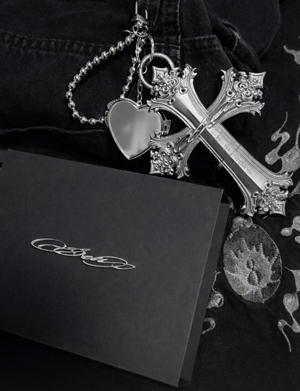

## Demo E-commerce Platform

---

## Overview

A full-stack web application designed for gothic-inspired merchandise.

> UX/UI

- Dark luxury Theme
- POC Level E-Commerce
- Scalable architecture (Next.js + Prisma)

---

## Tech Stack

**Frontend**

- Next.js
- TailwindCSS
- Framer Motion

**Backend**

- Node.js / API Routes

**Database**

- Mock Up(Future -> postgresql)

**Other**

- Stripe (payment)
- Cloudinary (media)

---

## Features

- Product catalog + filters
- Shopping cart system
- Checkout (Stripe integration)
- CMS-like content (banner/news)

---

## Design System

- Dark-first UI (#0B0B0B base)
- High contrast typography
- Gothic + Luxury

---
